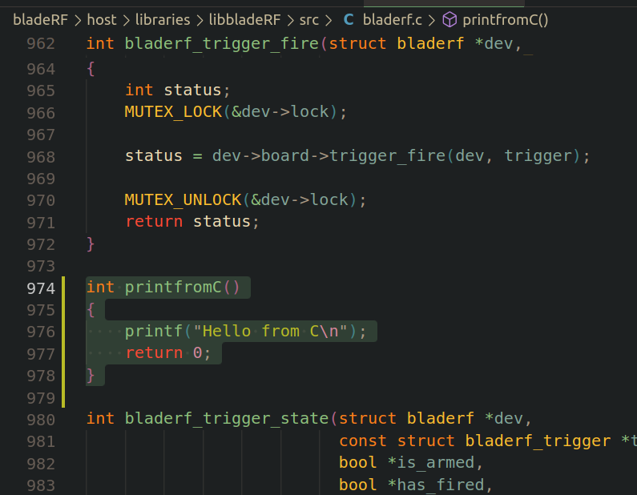
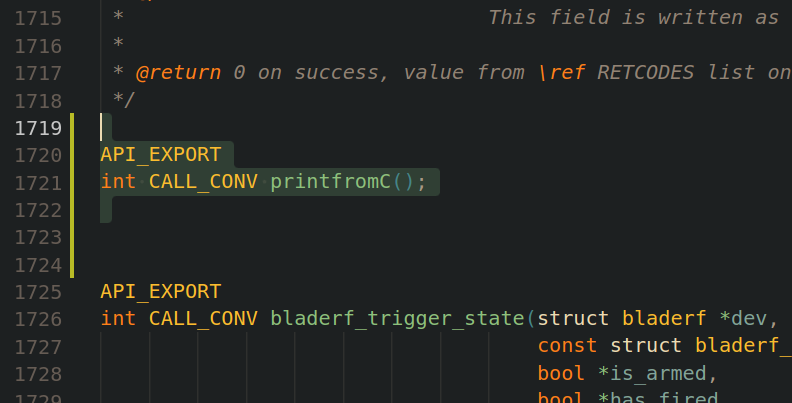
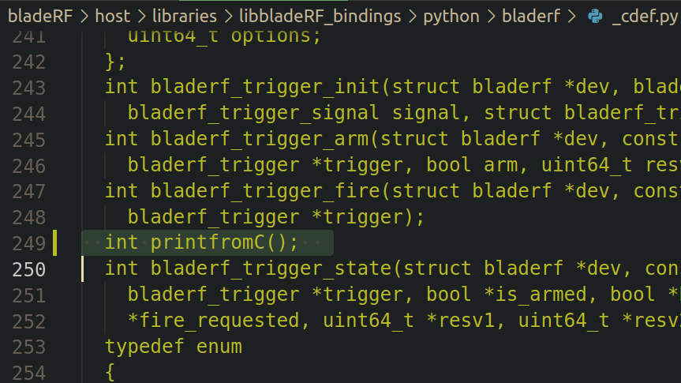
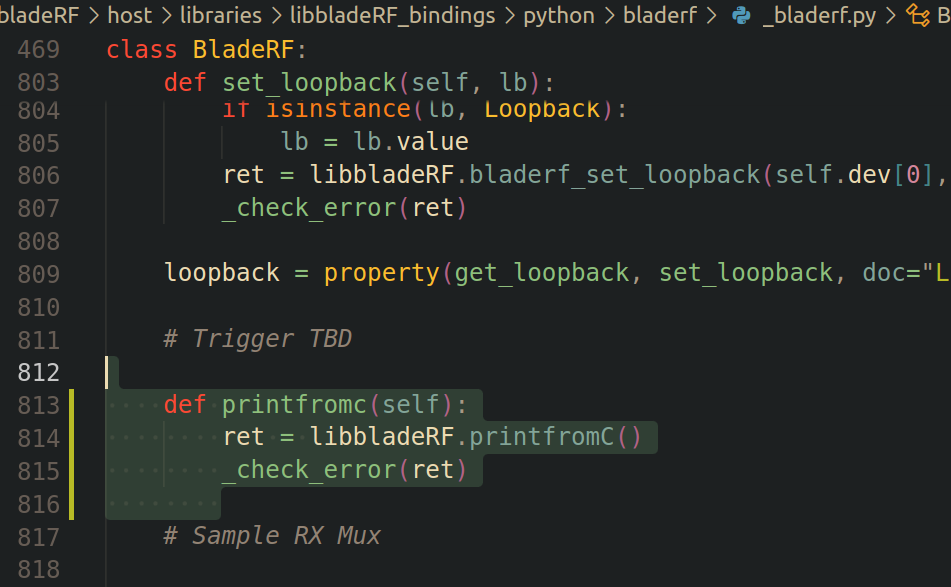
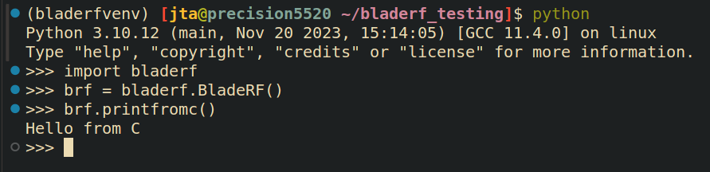
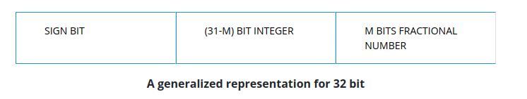
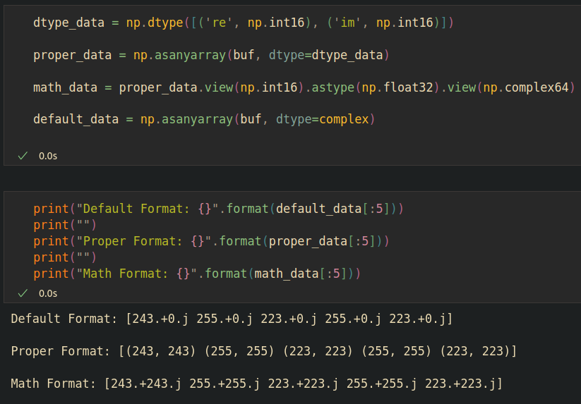

# BladeRF Starting Guide
#### *This assumes a Linux system.

## Setup
### Install Dependencies:
- libusb >= 1.0.16
- cmake >= 2.8.5

### Download FPGA Bitstream and Firmware
- https://www.nuand.com/fpga/hostedxA4-latest.rbf
- https://www.nuand.com/fx3/bladeRF_fw_latest.img

### 2: Library Installation
~~~
git clone git@github.com:Nuand/bladeRF.git

cd bladeRF

mkdir -p build && cd build

cmake ../

make

sudo make install

sudo ldconfig
~~~

### 3: Python 3 Bindings Installation
~~~
cd bladeRF/host/libraries/libbladeRF_bindings/python

python3 setup.py install
~~~

### 4: Load Bitstream and Firmware
~~~
bladeRF-cli -f bladeRF_fw_latest.img

bladeRF-cli -L hostedxA4-latest.rbf
~~~

## Editing libbladeRF

### 1: Defining the function in C
The file to edit will be
~~~
bladeRF/host/libraries/libbladeRF/src/bladerf.c
~~~

In this file, we will add a function "printfromC"

### 2: Defining the function in headers
The file is:
~~~
bladeRF/host/libraries/libbladeRF/include/libbladeRF.h
~~~

Add the function definition in the header.

### 3: Importing the function in Python
Python is using CFFI (C Foreign Function Interface) in order to interact with the libbladeRF C code.

In order to use this, we must first import our functions and then wrap them in a Python class in order to call them.

The file which imports libbladeRF functions is:
~~~
bladeRF/host/libraries/libbladeRF_bindings/python/bladerf/_cdef.py
~~~

This file is usually automatically generated by:
~~~
bladeRF/host/libraries/libbladeRF_bindings/python/scripts/import_header.py
~~~
However, it is pretty specific to work on the unedited libbladeRF.h file, so we just add our own line to the _cdef file above:

Next, we can finally add the function to the BladeRF Python class, this file is located at:
~~~
bladeRF/host/libraries/libbladeRF_bindings/python/bladerf/_bladerf.py
~~~
Adding our function, note we need to check the device status after each call with "_check_error(ret)" with the return value. The bladeRF source shows that status code "0" is given when no error occurs, so for our simple function we made it always return 0;

### 4: Rebuilding libbladeRF and Python bindings
To rebuild libbladeRF, follow the normal instructions above:
NOTE: this assumes the build directory already exists
~~~
cd bladeRF/
sudo rm -r build/*
cd build/
cmake ../
make -j8
sudo make -j8 install
sudo ldconfig
~~~
To rebuild the Python bindings, enter these commands:
~~~
cd ../host/libraries/libbladeRF_bindings/python
python setup.py install
~~~
NOTE: if using a python virtual environment, make sure to activate before to install the bindings to the correct "python"

Now you can use the class function in Python and it will be running the backend C code.

## Data Formatting Problems
The each sample we receive is a signed, complex 16-bit Q11. The "Q" describes a number format for representing fractional numbers with only integers. This format was developed by Texas Instruments in the early 1980's as a custom, fixed point, solution for quick math operations on their TMS320C64x DSP CPU. 

The numbers we wish to represent are between [-1.0, 1.0), note the inclusive lower bound and exlusive upper bound. The Q notation is either denoted as "Qm" or "Qx.y".

In our case, we have 11 bits dedicated to the fractional portion, 1 bit dedicated to the sign, and 4 bits dedicated to the integer. Something to note, when we use the sign bit on the smaller of the sections, so in our case we use it for the integer section.

From sources given by Texas Instruments, we can calculate the ranges for the numbers we expect to see. A signed, 16-bit Q11 number ranges from -2^11 to 2^11 - 2^-4, which is -2048 to 2047.9375 . We can also verify this at https://www.nuand.com/libbladeRF-doc/v2.5.0/group___s_t_r_e_a_m_i_n_g___f_o_r_m_a_t.html#gga4c61587834fd4de51a8e2d34e14a73b2a92cfbda7a5577c809e2ff6123f8f30b6 , which shows this exact range.

### 1: Problems

The backend that runs numpy is almost entirely written in C using old, mature math software that solves linear algebra problems as efficiently as possible. The problem lies, Q format is a rare format to see hardware acceleration on all but DSP chips. As such, there is no way to deal with these Q format numbers we receive directly.

To show this, lets take the situation where we get the RX'd data and show the ways you can interpret it in python:

As you can see, the default "complex" data type will attempt to read the binary data in "buf" as two 64-bit-precision floating-point numbers. We can see this being wrong as in every case we incorrectly read the imaginary part of the sample.

Q format is not standard in C/C++ or numpy, as such we define it ourselves as "dtype_data" above, following the format guidelines given by Nuand.

Another problem occurs with this format. We cannot do default mathematical operations on a custom defined data type. As such, we convert our data once more: take the proper data, view all 16-bit integers as a single 32-bit floating point number, and view all of those 32-bit floating point numbers as a typical 64-bit complex number. Doing this allows us to perform typical operations expected of complex-valued data and maintain the integrity of the true data.

## Sync Multiple BladeRFs
In order to synchronize multiple BladeRF devices, there are a couple physical connections to make on the devices.

### The 