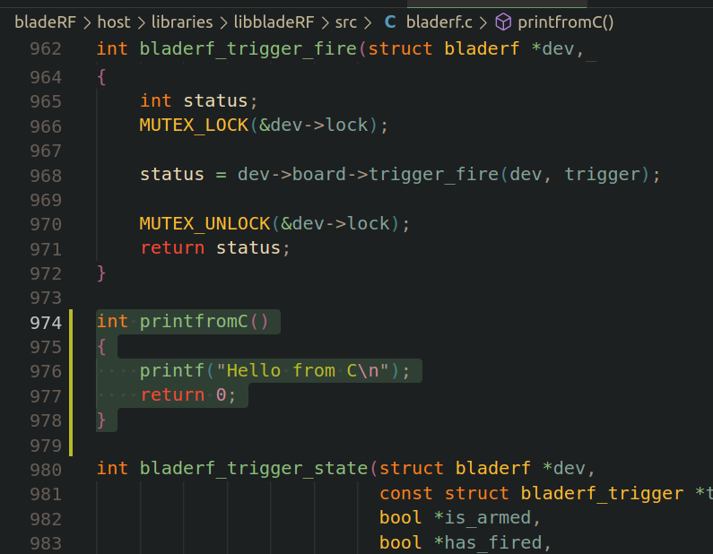
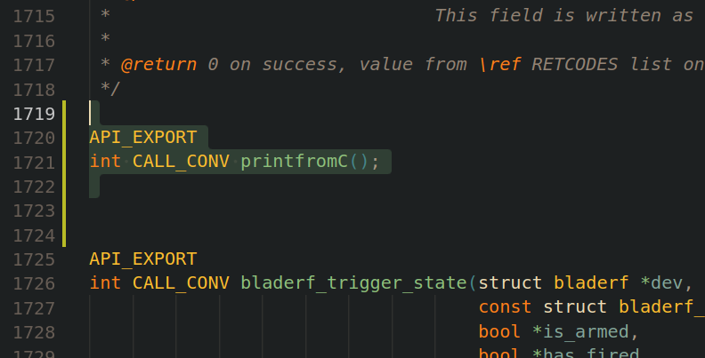
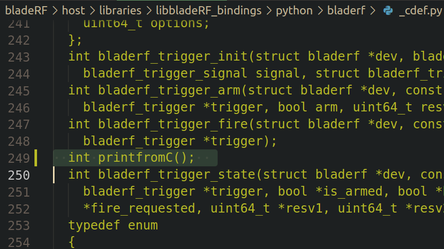
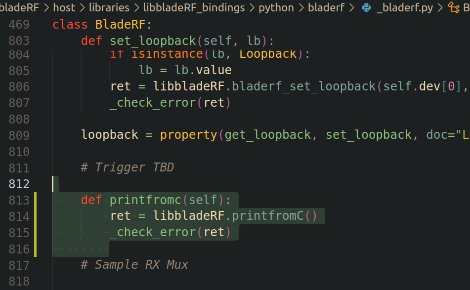
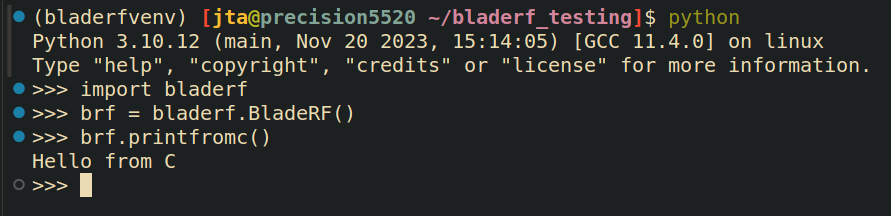

# BladeRF Starting Guide
#### *This assumes a Linux system.

## Setup
### Install Dependencies:
- libusb >= 1.0.16
- cmake >= 2.8.5

### Download FPGA Bitstream and Firmware
- https://www.nuand.com/fpga/hostedxA4-latest.rbf
- https://www.nuand.com/fx3/bladeRF_fw_latest.img

### 2: Library Installation
~~~
git clone git@github.com:Nuand/bladeRF.git

cd bladeRF

mkdir -p build && cd build

cmake ../

make

sudo make install

sudo ldconfig
~~~

### 3: Python 3 Bindings Installation
~~~
cd bladeRF/host/libraries/libbladeRF_bindings/python

python3 setup.py install
~~~

### 4: Load Bitstream and Firmware
~~~
bladeRF-cli -f bladeRF_fw_latest.img

bladeRF-cli -L hostedxA4-latest.rbf
~~~

## Editing libbladeRF

### 1: Defining the function in C
The file to edit will be
~~~
bladeRF/host/libraries/libbladeRF/src/bladerf.c
~~~

In this file, we will add a function "printfromC"

### 2: Defining the function in headers
The file is:
~~~
bladeRF/host/libraries/libbladeRF/include/libbladeRF.h
~~~

Add the function definition in the header.

### 3: Importing the function in Python
Python is using CFFI (C Foreign Function Interface) in order to interact with the libbladeRF C code.

In order to use this, we must first import our functions and then wrap them in a Python class in order to call them.

The file which imports libbladeRF functions is:
~~~
bladeRF/host/libraries/libbladeRF_bindings/python/bladerf/_cdef.py
~~~

This file is usually automatically generated by:
~~~
bladeRF/host/libraries/libbladeRF_bindings/python/scripts/import_header.py
~~~
However, it is pretty specific to work on the unedited libbladeRF.h file, so we just add our own line to the _cdef file above:

Next, we can finally add the function to the BladeRF Python class, this file is located at:
~~~
bladeRF/host/libraries/libbladeRF_bindings/python/bladerf/_bladerf.py
~~~
Adding our function, note we need to check the device status after each call with "_check_error(ret)" with the return value. The bladeRF source shows that status code "0" is given when no error occurs, so for our simple function we made it always return 0;

### 4: Rebuilding libbladeRF and Python bindings
To rebuild libbladeRF, follow the normal instructions above:
NOTE: this assumes the build directory already exists
~~~
cd bladeRF/
sudo rm -r build/*
cd build/
cmake ../
make -j8
sudo make -j8 install
sudo ldconfig
~~~
To rebuild the Python bindings, enter these commands:
~~~
cd ../host/libraries/libbladeRF_bindings/python
python setup.py install
~~~
NOTE: if using a python virtual environment, make sure to activate before to install the bindings to the correct "python"

Now you can use the class function in Python and it will be running the backend C code.

